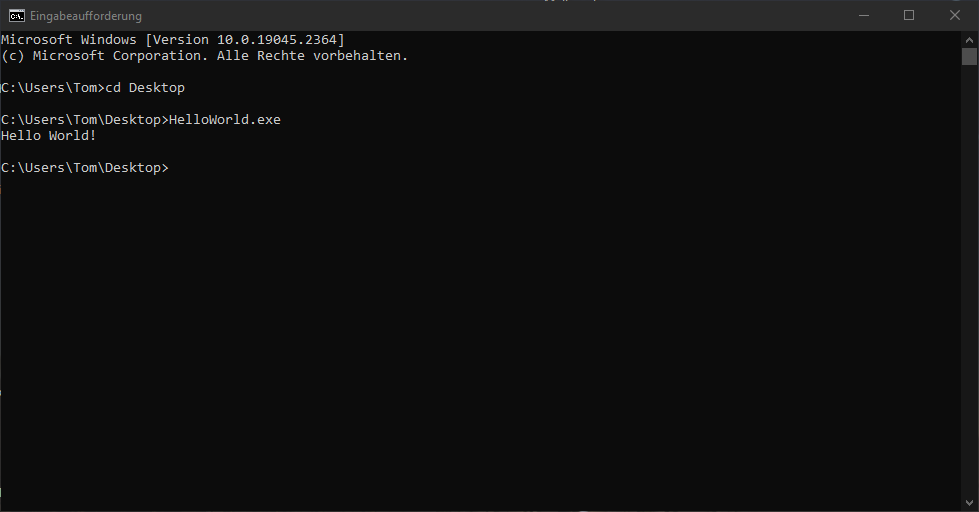

# Hello World

## Requirements
Windows 10 or later
## Installation
Copy the [executable](./x64/Release/HelloWorld.exe) to a preferred location on your computer and navigate in the commandline to the folder, in which the [file](./x64/Release/HelloWorld.exe) is located. Then type "Hello World.exe" and enjoy this great piece of software.
